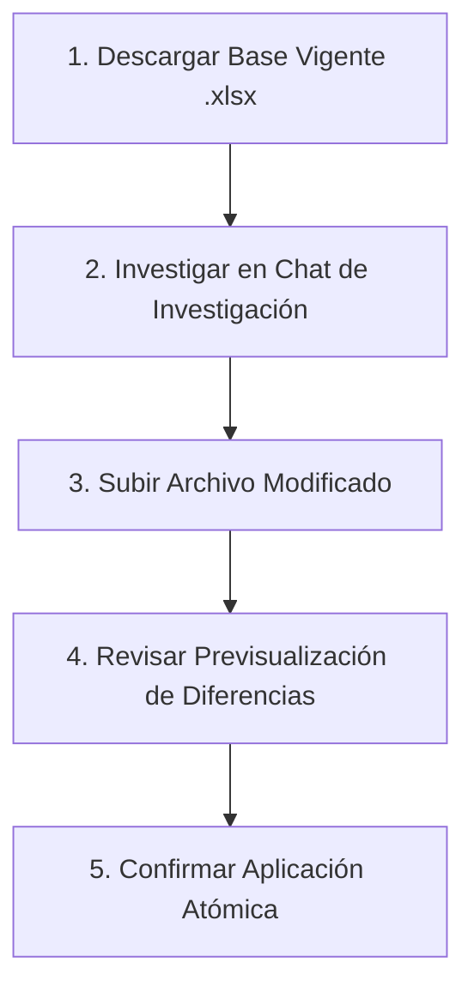

# 📖 Manual del Administrador — Humm Financiamiento

Versión 1.0 · Septiembre 2026

Este manual describe el funcionamiento y las rutinas operativas del panel de administración de **Humm Financiamiento**, accesible en la ruta `/gestion/`.

---

## 1. Estructura del Panel de Administración

El panel está organizado en cuatro secciones principales:

| Sección | Ruta | Función Principal |
|---|---|---|
| **Dashboard** | `/gestion/` | Resumen cuantitativo, alertas de convocatorias por revisar, convocatorias abiertas activas e historial de actualizaciones con opción de reversión. |
| **Catálogo** | `/gestion/catalogo/` | Búsqueda y listado detallado de Entidades, Instrumentos y Convocatorias, con semáforos de vigencia y enlaces a fuentes oficiales. |
| **Preguntas y Orientación** | `/gestion/preguntas/` | Edición de títulos, textos de ayuda y etiquetas visibles de las 5 preguntas oficiales, y activación/desactivación de opciones. |
| **Importar y Exportar** | `/gestion/importar-exportar/` | Descarga de la base actual en Excel (.xlsx), descarga de plantilla vacía, análisis con previsualización de diferencias y confirmación atómica. |
| **Configuración** | `/gestion/configuracion/` | Nombre visible de la herramienta, URL de retorno a Comunidad Humm, datos de contacto (WhatsApp/Email) y plazos de revisión editorial. |

---

## 2. Rutina de Actualización del Catálogo con Excel (.xlsx)

Para actualizar el catálogo sin necesidad de tocar código ni realizar migraciones, sigue este flujo de 5 pasos:

### Paso 1: Descargar la base vigente
1. Ingresa a **Importar y Exportar** (`/gestion/importar-exportar/`).
2. Haz clic en **"Exportar base vigente (vX)"**.
3. Se descargará un archivo `.xlsx` con todas las entidades, instrumentos y convocatorias registradas hasta el momento, junto con el número de versión de la base en la hoja `Control`.

### Paso 2: Investigar y actualizar datos
1. Lleva el archivo descargado a tu chat exclusivo de investigación.
2. Sigue las pautas descritas en `INSTRUCCIONES_ACTUALIZACION_CATALOGO.md`.
3. Guarda el archivo `.xlsx` con las modificaciones.

### Paso 3: Subir el archivo
1. En la misma sección **Importar y Exportar**, ve al bloque **"2. Subir archivo actualizado"**.
2. Selecciona tu archivo `.xlsx` y haz clic en **"Analizar archivo y ver diferencias"**.

### Paso 4: Revisar la previsualización de diferencias (*Diff*)
El sistema revisará automáticamente el archivo antes de modificar la base de datos:
* **Errores bloqueantes (Rojo)**: Si existen IDs duplicados, relaciones inexistentes o fechas invertidas, el sistema te indicará la hoja y fila exacta del problema. El botón de aplicación se bloqueará para proteger la base de datos.
* **Advertencias (Ámbar)**: Alerta si el archivo proviene de una versión anterior de la base y alguien realizó cambios intermedios.
* **Diferencias detectadas**: Podrás ver tabla por tabla qué registros son nuevos y qué campos específicos fueron modificados (mostrando el valor anterior tachado en rojo y el propuesto en verde).

### Paso 5: Confirmar aplicación
1. Si la previsualización es correcta, presiona **"Confirmar y aplicar cambios en catálogo"**.
2. Todos los cambios se aplicarán en una sola transacción segura (todo o nada).
3. Se incrementará automáticamente la versión del catálogo (ej. de v1 a v2) y se creará un registro de auditoría con la fecha, usuario y el resumen de cambios.

---

## 3. Reversión Segura de un Lote de Importación

Si cometiste un error o cargaste un archivo equivocado:
1. Dirígete al **Dashboard** (`/gestion/`).
2. En la tabla inferior **"Historial reciente de actualizaciones"**, ubica el lote que deseas revertir.
3. Haz clic en el enlace **"Revertir"** junto al lote.
4. El sistema restaurará automáticamente los valores anteriores que tenían esos registros y eliminará los registros nuevos introducidos por ese lote, generando un nuevo evento de auditoría.

---

## 4. Edición de Preguntas y Cuestionario

En la sección **Preguntas y Orientación** (`/gestion/preguntas/`):
* Puedes ajustar la redacción de los títulos visibles y textos de ayuda de las 5 preguntas oficiales.
* Puedes cambiar las etiquetas visibles de las opciones para hacerlas más claras para los emprendedores.
* Puedes deshabilitar temporalmente una opción desmarcando la casilla "Habilitada".
* **Límites de diseño**:
  * No se permite superar el máximo de 5 preguntas activas.
  * Los códigos internos (como `equipamiento`, `idea`, `CL-LR`) son estables y no deben modificarse, ya que están vinculados a las reglas deterministas de orientación del catálogo.

---

## 5. Políticas de Vigencia y Semáforos

El motor calcula dinámicamente el estado que ve el usuario según las siguientes reglas:
* **Abierta (verificada)**: Evidencia de apertura comprobada hace menos de 7 días y fecha de cierre no vencida.
* **Cierra hoy: confirmar hora**: La convocatoria vence hoy pero no tiene hora exacta informada; se advierte revisar temprano en la fuente oficial.
* **Plazo informado finalizado**: La fecha y hora de cierre ya pasaron; el sistema la marca cerrada automáticamente aun sin intervención administrativa.
* **Vigencia por confirmar**: La convocatoria figura abierta pero la última revisión oficial tiene más de 7 días de antigüedad. Requiere visitar el portal y actualizar la fecha de verificación.
* **Apertura prevista: confirmar vigencia**: Llegó la fecha en que supuestamente abría el llamado, pero requiere confirmación humana en la fuente antes de declararla abierta.
* **Convocatoria suspendida / cancelada**: Prevalece sobre cualquier calendario previo.
